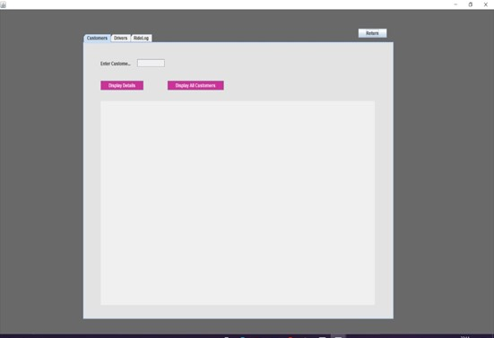

# Cabber
Cab-Booking-App

## Problem Definition
### Develop a template GUI application that can be utilized by Cab Rental Agencies.

 

Most of the Big Players in the Cab Booking Industry have raised a bar by extremely User-Friendly Applications which have been very popular in grabbing interest among customers as they consider it to be Hassle-Free and something which happens extremely Handy on the go. The main aim of our application Cabber is to raise voice and go vocal for local, where cab-agencies across the city put the best services and rates forward to make the customer journey more comfortable and price-friendly and compete with dominant startups which have dried down the business.

### Objectives
* Customers can sign up to the application and book rides
*	The customer can book a ride types of car available according to their connivence and get the estimated fare for the ride based on the distance and type of car chosen.
*	Drivers can sign up and transport Customers based on the ride booked.
*	Customer can access their previous ride.
*	Customer will be provided with details of driver and cab for the security reasons.
*	If a driver is already assigned to a ride, then the subsequent rides will be assigned to other drivers

### Design Patterns:
In the project we have identified and implemented two design patterns.
1. Singleton
2. Factory

### Class Diagram

## Requirements
1. Java Development Kit >=15.0
2. Eclipse
3. Window Builder Plug-in 

## GUI Images
1. Main page Login/Signup

2. Customer Sign-up

3. Driver Signup

4. Customer Account Details

5. Customer Book Ride

6. Rider Log

### Refer to project report for further details regarding design patterns and classes used.
